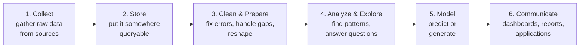
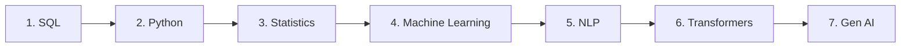

# Data Science Roadmap — Overview & Foundations

**Start here.** This is the foundation for everything else in the roadmap. Before touching SQL, Python, or machine learning, this note answers the most basic questions: *What is data? Where does it come from? Where does it live? How does it move? What does the field look like, and what will I actually learn here?*

No prior background needed — every term is explained.

→ Back to [Roadmap Home](../README.md)

---

## Table of Contents

- [What This Roadmap Is](#what-this-roadmap-is)
- [What Is Data?](#what-is-data)
- [Data vs. Information vs. Knowledge](#data-vs-information-vs-knowledge)
- [Types of Data](#types-of-data)
- [What Is Data Science?](#what-is-data-science)
- [The Data Roles](#the-data-roles)
- [The Data Lifecycle](#the-data-lifecycle)
- [Where Data Comes From](#where-data-comes-from)
- [How Data Moves: Batch vs. Streaming](#how-data-moves-batch-vs-streaming)
- [Where Data Lives: Storage Systems](#where-data-lives-storage-systems)
- [What's a Pipeline?](#whats-a-pipeline)
- [Big Data & Distributed Computing](#big-data--distributed-computing)
- [Cloud vs. On-Premise](#cloud-vs-on-premise)
- [Keeping Data Trustworthy: Governance & Quality](#keeping-data-trustworthy-governance--quality)
- [How Data Reaches People: BI & APIs](#how-data-reaches-people-bi--apis)
- [The Skills Landscape](#the-skills-landscape)
- [The 7-Week Roadmap](#the-7-week-roadmap)
- [How to Use This Repo](#how-to-use-this-repo)
- [Glossary](#glossary)

---

## What This Roadmap Is

A structured, 7-week self-study plan to build the skills for data-focused roles — data analyst, data scientist, data engineer, and adjacent jobs. Each week covers one core topic, with **notes** (what I learned) and **projects** (proof I can apply it), all kept here on GitHub so the learning is visible and organized.

This overview is **Week 0**: orientation. After this, the roadmap begins properly with **SQL**.

## What Is Data?

**Data is recorded facts** — raw values, observations, or measurements, captured in a form that can be stored and processed.

That's it. A number, a word, a date, a click, a pixel, a temperature reading — each is a piece of data. On its own, a single piece of data usually doesn't tell you much.

Examples of data:
- The number `85`
- The text `"Mumbai"`
- The date `2026-01-15`
- A photo file
- A row in a spreadsheet: `1024, "John", 85`

The entire data field exists to turn these raw, often meaningless values into something **useful** — something a person or a system can make a decision with.

## Data vs. Information vs. Knowledge

These three words get used loosely, but the distinction is the foundation of everything that follows:

| Term | What it is | Example |
|------|-----------|---------|
| **Data** | Raw, unprocessed facts. No context. | `1024`, `"John"`, `85` |
| **Information** | Data + context, so it carries meaning | "Student #1024, John, scored 85 in Math" |
| **Knowledge** | Information + patterns understood over time | "Students who attend lab regularly tend to score above 80" |

This is often drawn as the **DIKW pyramid** — **D**ata → **I**nformation → **K**nowledge → **W**isdom — each layer more refined and more valuable than the one below.

**Why it matters:** every tool and technique in this roadmap is, at its core, a way of moving *up* this pyramid — from raw data toward useful knowledge.

## Types of Data

Data comes in a few important flavors. Knowing the type tells you how to store it and work with it.

**By structure:**

| Type | Meaning | Examples |
|------|---------|----------|
| **Structured** | Highly organized — fits neatly into rows and columns with a fixed shape | Database tables, spreadsheets |
| **Semi-structured** | Has *some* organization (tags, keys) but no rigid table shape | JSON, XML, CSV |
| **Unstructured** | No predefined organization at all | Text, images, audio, video, emails |

**By nature:**

| Type | Meaning | Examples |
|------|---------|----------|
| **Quantitative** | Numeric — things you can measure or count | Age, price, temperature, click count |
| **Qualitative** | Descriptive — categories or labels, not numbers | Color, city name, "yes/no", product category |

> Roughly 80–90% of the world's data is **unstructured** — which is exactly why so much of modern data work (and this roadmap) is about making messy data usable.

## What Is Data Science?

"Data science" is an umbrella term for **using data to answer questions and make decisions.** In practice it spans a few connected disciplines:

- **Data Analytics** — exploring data to describe what *has happened* and why (reports, dashboards, trends).
- **Data Engineering** — building the systems and pipelines that *collect, move, and prepare* data so others can use it.
- **Machine Learning** — building models that *predict* or *generate* — what *will* happen, or what something *should* be.
- **Data Science** (narrow sense) — combining statistics, programming, and domain knowledge to find insights and build models.

They overlap heavily, and the same person often does several. This roadmap deliberately builds skills that cut across all of them.

## The Data Roles

Knowing the roles helps you see what you're aiming for.

| Role | Core question they answer | Main tools |
|------|---------------------------|-----------|
| **Data Analyst** | "What happened, and why?" | SQL, Excel, BI tools, some Python |
| **Data Scientist** | "What will happen? What patterns exist?" | Python, statistics, ML, SQL |
| **Data Engineer** | "How do we get clean, reliable data to everyone?" | SQL, Python, pipelines, cloud |
| **ML Engineer** | "How do we run models reliably in production?" | Python, ML frameworks, cloud, software engineering |
| **Analytics Engineer** | "How do we model and prepare data for analysis?" | SQL, dbt, data warehouses |

Notice what shows up in *every single row*: **SQL**. That's not an accident — and it's why the roadmap starts there.

## The Data Lifecycle

Almost every data project, in any role, follows the same journey. This is the mental model to carry through the whole roadmap.

1. **Collect** — data comes from databases, files, APIs, sensors, apps, websites.
2. **Store** — it's placed somewhere it can be queried: a database, data warehouse, or data lake.
3. **Clean & Prepare** — raw data is messy: duplicates, missing values, wrong types, inconsistent formats. This step fixes that. (Often called *data wrangling*.)
4. **Analyze & Explore** — ask questions of the data, find trends and relationships. (*Exploratory Data Analysis*, or EDA.)
5. **Model** — build something predictive or generative — a machine learning model.
6. **Communicate** — turn results into something people can act on: a dashboard, a report, a product feature.

> Every topic in this roadmap plugs into this lifecycle. SQL is mostly steps 2–4. Python spans 3–6. Statistics underpins 4–5. ML is step 5. The Gen AI topics extend step 5 into *generating* new content.

**The next several sections zoom into *how* each stage actually works in practice** — the kinds of sources, systems, and choices you'll meet as you move through the roadmap.

## Where Data Comes From

Once you know what data is, the natural next question is: *where does it come from?*

Data is "born" in five main types of places. Almost every data project pulls from one or more of these.

| Source | What it is | Examples |
|--------|-----------|----------|
| **Databases** | Software systems that store organized data, usually running the business day to day | PostgreSQL, MySQL, MongoDB |
| **APIs** | A defined "doorway" that lets one software system request data from another | Google Maps API, payment gateway APIs |
| **Files** | Data delivered as files, often exports from another system | CSV, JSON, XML |
| **Event Streams** | A continuous flow of small records describing things that *just happened* | Kafka topics, IoT sensor feeds |
| **Web Scraping** | Programmatically extracting data from websites that don't offer an API | Done with tools like Scrapy or BeautifulSoup |

> **Key term — API (Application Programming Interface):** a structured way for one software system to *ask* another for data. Instead of accessing another company's database directly, you politely request data through their API, which hands it back in a defined format.

**Example — a cab service** pulls from *all five* at once: weather APIs (for surge pricing), payment gateway logs, rider and driver databases, app event streams (every tap and ride request), and possibly competitor scraping.

## How Data Moves: Batch vs. Streaming

There are two fundamentally different ways to move data through the pipeline.

| Mode | How it works | Analogy | Best for |
|------|-------------|---------|----------|
| **Batch** | Data is moved on a **schedule**, in chunks (every hour, every night) | Doing all the laundry once a week | Reports, backups — anything where hours of delay are fine |
| **Real-time (Streaming)** | Data is moved **continuously, the instant it's created** | Washing each dish the moment you use it | Fraud detection, live pricing — anything where seconds matter |

**How to choose:** ask *"how stale can this data be before it's useless?"* If "hours are fine" → batch. If "seconds matter" → streaming.

> **Key term — latency:** the delay between when data is created and when it's available to use. Batch has *high latency* (hours); streaming has *very low latency* (seconds or less).

Common tools: **Apache Kafka** is the industry standard for real-time event streams; **Apache NiFi** offers a drag-and-drop interface for building flows.

## Where Data Lives: Storage Systems

Once collected, data has to be *stored* somewhere it can be queried efficiently. Different storage types are built for different jobs.

| Storage | What it is | Best for | Examples |
|---------|-----------|----------|----------|
| **Relational Database (RDBMS)** | Structured tables with a fixed schema, queried with SQL | Transactional systems, structured data | PostgreSQL, MySQL, SQL Server |
| **NoSQL Database** | Flexible, non-table storage for semi/unstructured data | High-volume, fast-changing data | MongoDB, Cassandra |
| **Data Lake** | Cheap storage for raw files of any type | Landing zone for everything, raw and unprocessed | AWS S3, Azure Blob |
| **Data Warehouse** | Storage optimized for analytical queries on structured data | BI, reporting, organization-wide analytics | Snowflake, BigQuery, Redshift |
| **Data Lakehouse** | A hybrid of lake + warehouse | Best of both worlds in one system | Databricks, modern Snowflake |

**The classic analogy:** a **data lake** is like a natural lake — raw water flows in from everywhere, untreated, all mixed together. Cheap to fill, but you can't drink straight from it. A **data warehouse** is like a bottled-water factory — water is filtered, labeled, neatly shelved, ready to use.

> **Related term — data mart:** a *small, focused slice* of a data warehouse, scoped to one team or topic (e.g., a "Sales" data mart contains only sales-related data).

## What's a Pipeline?

A **data pipeline** is an **automated workflow that moves data from a source to a destination, transforming it along the way**. Pipelines are the *machinery* that runs the lifecycle.

**An analogy:** a pipeline is like a factory assembly line — raw material enters one end, passes through stations (each doing one job: cleaning, reshaping, validating), and a finished product comes out the other end. Automatically. Repeatedly. Without anyone carrying parts by hand.

Good pipelines are:
- **Modular** — built from reusable steps, not one giant script.
- **Reliable** — they handle errors gracefully and retry, instead of silently breaking.
- **Orchestrated** — a tool like **Apache Airflow** schedules them and manages the order tasks run in (the "conductor of the orchestra").

> **Key term — ETL / ELT:** the two standard recipes for *what happens inside a pipeline*. **ETL** = Extract, Transform, Load (clean the data, *then* store it). **ELT** = Extract, Load, Transform (store it raw first, *then* clean it inside the warehouse). Modern cloud platforms favor ELT.

## Big Data & Distributed Computing

When data gets *too big or too fast* for a single computer, you need many computers cooperating as one. This is the world of **big data**.

- **Big data** typically means datasets so large they're measured in **terabytes (TB) or petabytes (PB)**. For reference: 1 TB ≈ 1,000 GB; 1 PB ≈ 1,000 TB.
- A single computer can't store or process that much fast enough. Instead, the data and the work are **split across many ordinary computers** that act together — this is called **distributed computing**.
- If one of those machines fails, the others carry on, because copies of the data are kept on multiple machines. This is called **fault tolerance**.

**The two big names in this space:**

| Tool | What it is | Strength |
|------|-----------|----------|
| **Hadoop** | The original big-data framework: stores data across many machines (**HDFS**) and processes it in parallel (**MapReduce**) | Pioneered affordable big data |
| **Apache Spark** | A faster, more modern processing engine; works mostly in memory instead of disk | The current workhorse for big data + ML |

> Spark mostly replaced Hadoop's processing model (MapReduce) because it's much faster. But the *idea* of splitting data and work across many cheap machines — that was Hadoop's breakthrough, and it's what made modern data engineering possible.

## Cloud vs. On-Premise

Where do all these systems actually *run?*

- **Cloud** — you rent computing power and storage from a provider (AWS, Azure, GCP) over the internet, paying only for what you use. No hardware to buy or maintain.
- **On-premise ("on-prem")** — you run everything on your own company's servers. More control, more responsibility.

| Approach | Pros | Cons |
|----------|------|------|
| **Cloud** | Flexible, instantly scalable, no hardware management | Costs add up; data lives elsewhere |
| **On-prem** | Full control, can be cheaper at very large scale, data stays in-house | You manage everything: servers, security, scaling |

**The big three cloud providers** offer equivalent services with different names:

| Need | AWS | Azure | GCP |
|------|-----|-------|-----|
| **Storage** | S3 | Blob Storage | Cloud Storage |
| **Data Warehouse** | Redshift | Synapse | BigQuery |
| **ETL / Pipelines** | Glue | Data Factory | Dataflow |

Most new data work today runs in the cloud, but many large companies use a **hybrid** — some on-prem, some cloud.

## Keeping Data Trustworthy: Governance & Quality

Building pipelines is one half of the job. Making sure the data they produce is *correct, secure, and findable* is the other half.

**Data Governance** covers a few related concerns:
- **Data Lineage** — *"Where did this number come from?"* Tracing data backward through every transformation to its source. Useful when a dashboard shows something suspicious.
- **Data Cataloging** — *"A search engine for our data."* An organized index of every table and file: what it means, who owns it, when it was last updated. Tools: **AWS Glue Data Catalog**, **Apache Atlas**.
- **Masking** — *Hiding* sensitive parts of data (showing `****1234` instead of a full card number).
- **Encryption** — *Scrambling* data into a code that's useless without the key.

**Data Quality & Testing** is about catching bad data *before* it reaches users:
- **Validation** — schema checks: does the data have the expected columns, types, and rules?
- **Great Expectations** — a popular framework for *testing data* the way developers test code (*"this column should never be null"*).
- **Unit testing** — using **pytest** to test the logic of ETL scripts.

> **Beginner principle — "garbage in, garbage out":** every report, model, and decision downstream depends on data quality. Testing data isn't optional polish — it's core to the job.

## How Data Reaches People: BI & APIs

After all the collection, storage, and cleaning — how does the data actually *reach the people and systems that use it?* This is the **consumption layer** — the payoff stage of the lifecycle.

**For humans → dashboards (BI tools).**
**B**usiness **I**ntelligence tools turn curated data into charts, dashboards, and reports.
- **Power BI** (Microsoft) — strong on data modeling and the **DAX** formula language.
- **Tableau** — strong on interactive, exploratory dashboards.

**Good reporting practice:**
- Focus on **KPIs (Key Performance Indicators)** — metrics that actually drive business decisions, not vanity numbers.
- **Automate** refresh so reports are always current.
- Treat dashboards as **storytelling** — they should lead a viewer to an *insight*, not just dump numbers.

**For software → APIs.**
When *another application* (not a person) needs the data, you serve it through an **API**. Lightweight Python frameworks like **Flask** or **FastAPI** are commonly used to build these.

**For ML → feature serving.**
Cleaned, transformed data is also served to **machine learning models** for both training and live predictions.

> This is where data finally becomes a decision — a chart someone reads, a feature someone uses, a prediction a model makes. Everything earlier in the pipeline exists to feed this moment.

## The Skills Landscape

A map of what you'll build, and why each piece matters:

| Skill | What it's for | Where it fits in the lifecycle |
|-------|---------------|--------------------------------|
| **SQL** | Asking questions of stored data — the universal language of databases | Store, Clean, Analyze |
| **Python** | General-purpose programming for data — cleaning, analysis, automation, ML | Clean → Communicate |
| **Statistics** | The math of uncertainty — drawing valid conclusions from data | Analyze, Model |
| **Machine Learning** | Building models that predict from patterns in data | Model |
| **NLP** | Teaching machines to work with human language (text) | Model (text data) |
| **Transformers** | The architecture behind modern AI — the engine of today's language models | Model (advanced) |
| **Gen AI & Prompt Engineering** | Using and directing generative models effectively | Model → Communicate |

## The 7-Week Roadmap

Here's the full plan, in a deliberate learning order — each topic builds on the ones before it.

| Week | Topic | What it is | Why it's here |
|------|-------|-----------|---------------|
| **1** | **SQL** | The language for retrieving and manipulating data in databases | Every data role uses it; it's the foundation for touching real data |
| **2** | **Python** | Programming for data work — cleaning, analysis, automation | The general-purpose tool that connects everything else |
| **3** | **Statistics** | The math of describing data and reasoning under uncertainty | You can't interpret data or trust a model without it |
| **4** | **Machine Learning** | Algorithms that learn patterns from data to make predictions | The core of predictive data science |
| **5** | **NLP** | Techniques for working with text and language data | Extends ML to the huge world of unstructured text |
| **6** | **Transformers** | The neural network architecture powering modern AI | The foundation under today's most powerful models |
| **7** | **Gen AI & Prompt Engineering** | Working with generative models, and directing them well | The cutting edge — and an in-demand, practical skill |

**The logic of the order:** you learn to *get* data (SQL), then to *manipulate* it programmatically (Python), then the *reasoning* tools to interpret it (Statistics), then to *predict* with it (ML), then apply that to *language* (NLP), then understand the *architecture* that revolutionized it (Transformers), and finally to *use and direct* generative AI (Gen AI).

## How to Use This Repo

- Each week's topic lives in its own numbered folder (`01-sql/`, `02-python/`, …).
- Inside each: a `README.md` (topic overview + progress), a `notes/` folder (what I learned), and a `practice/` or `projects/` area (proof I can apply it).
- This `00-overview/` folder is the orientation you're reading now — it sorts first, before the topics.
- Overall progress is tracked in the main [Roadmap Home](../README.md).

**Suggested weekly rhythm:** read/learn → take notes here → build a small practice project → update the progress tracker.

## Glossary

| Term | Meaning |
|------|---------|
| **Data** | Recorded raw facts — numbers, text, dates, files |
| **Information** | Data given context, so it carries meaning |
| **Structured data** | Data that fits neatly into rows and columns |
| **Unstructured data** | Data with no predefined format — text, images, audio |
| **Schema** | The structure of data — its columns, types, and rules |
| **Database** | An organized system for storing and retrieving data |
| **Query** | A request for specific data from a database |
| **API** | A structured doorway for one software system to request data from another |
| **Data wrangling / cleaning** | Fixing and reshaping messy raw data |
| **EDA** | Exploratory Data Analysis — investigating data to find patterns |
| **Batch** | Processing data in scheduled chunks |
| **Stream / Real-time** | Processing data continuously, the moment it arrives |
| **Latency** | The delay between data being created and being available to use |
| **Pipeline** | An automated workflow that moves and processes data |
| **ETL / ELT** | Extract, Transform, Load — the two standard recipes for moving and cleaning data |
| **Big data** | Datasets too large for traditional tools (TBs or PBs) |
| **Distributed computing** | Splitting data and work across many machines that cooperate as one |
| **Fault tolerance** | A system's ability to keep working when parts of it fail |
| **Data lake** | Cheap storage that holds raw data of any type |
| **Data warehouse** | Storage optimized for analytics on structured data |
| **Model** | A system that learns patterns from data to predict or generate |
| **KPI** | Key Performance Indicator — a metric that measures something important to the business |
| **Lineage** | Tracking where data came from and how it changed along the way |

---

*Part of my [Data Science Roadmap](../README.md) · Week 0 — Foundations*

**Next up:** Week 1 — SQL
