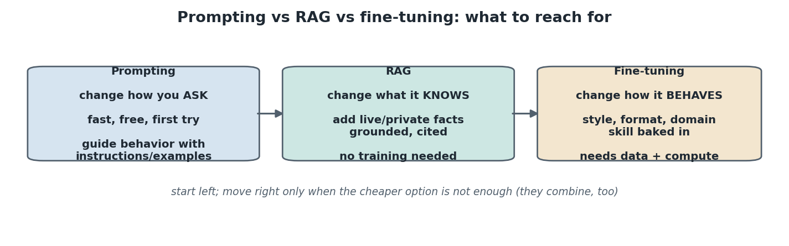
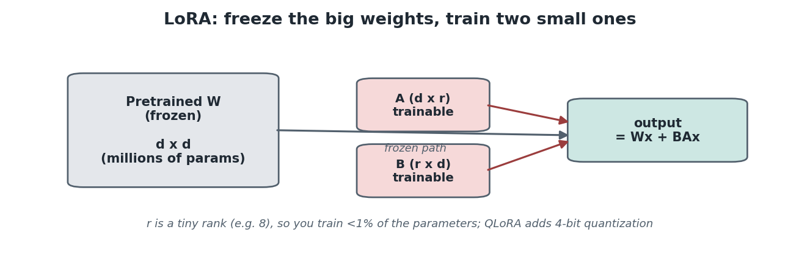
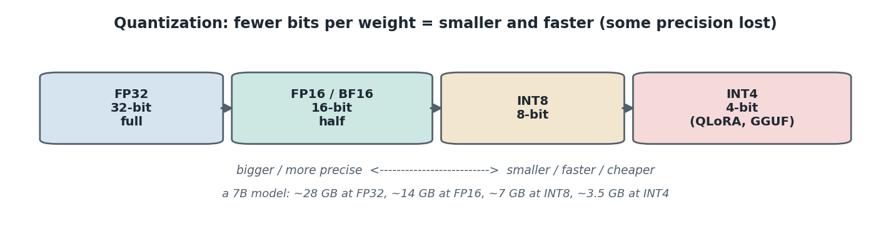
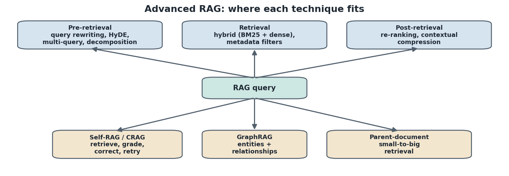
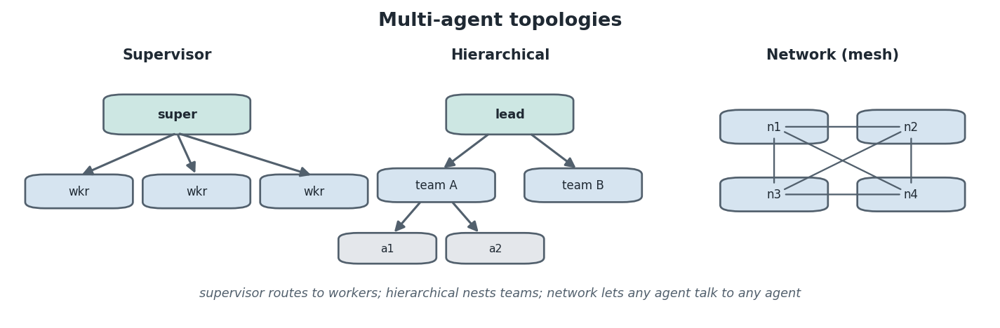
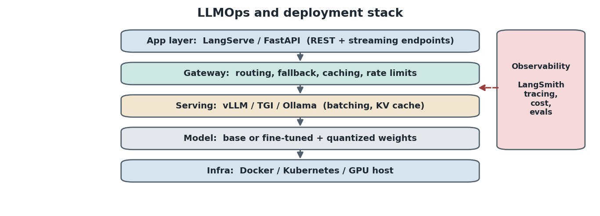

# Advanced Generative AI and Agentic AI

Advanced study notes that pick up where the core generative AI and agentic AI notes end. Those notes cover building with LLMs (LangChain, LangGraph, RAG, agents, deep agents, guardrails, evaluation, gateways). These notes cover the topics a full data science roadmap needs on top of that: adapting models (fine-tuning and PEFT), running them efficiently (quantization and serving), stronger retrieval (advanced RAG), the search internals underneath it, coordinating many agents (multi-agent systems), going beyond text (multimodal), getting models to reason, keeping them safe (security), and shipping them (LLMOps).

Where a number is stated, it is reproduced and checked. All commands assume the UV package manager. No topic here requires the others, so you can read them in any order, though a suggested learning order is at the end.

---

## Part 1: Fine-tuning and PEFT

Prompting and RAG change what a model is told; fine-tuning changes the model itself. It is the most common advanced topic in interviews, so it is worth understanding well.

### Prompting vs RAG vs fine-tuning

The first decision is which lever to pull, because they solve different problems.

**Prompting changes how you ask, RAG changes what the model knows, and fine-tuning changes how the model behaves.** Plainly:

- **Prompting**: guide the model with instructions and examples. Fast, free, and always the first thing to try.
- **RAG**: give the model live or private facts as context at query time. No training needed. Use it when the gap is knowledge.
- **Fine-tuning**: continue training the model on your data so a new skill, style, format, or domain is baked into the weights. Use it when the gap is behavior, not knowledge.



A simple rule: reach for the cheapest option first and move right only when it is not enough. They also combine. A common production setup is a fine-tuned model for tone and format plus RAG for facts. Fine-tuning teaches a behavior; it does not reliably teach facts, and it does not stop hallucination, so do not fine-tune to inject knowledge that changes often.

### Full fine-tuning and instruction tuning

The baseline is updating every weight.

**Full fine-tuning continues training all of a model's parameters on new data, and instruction tuning (supervised fine-tuning, SFT) is fine-tuning on input and desired-output pairs so the model learns to follow instructions in a certain way.** Plainly: you show the model many examples of a prompt and the answer you want, and it adjusts until it produces that style of answer. The training data is pairs, for example an instruction and its ideal response.

```python
# supervised fine-tuning data is just input/output pairs
example = {
    "messages": [
        {"role": "system", "content": "You are a support agent. Reply in one sentence."},
        {"role": "user", "content": "How do I reset my password?"},
        {"role": "assistant", "content": "Go to Settings, click 'Reset password', and follow the email link."},
    ]
}
# Output:
# after training on many such pairs, the model adopts the one-sentence support style
```

Full fine-tuning is powerful but expensive: for a large model it needs many GPUs and stores a full copy of the updated weights. That cost is what PEFT removes.

### PEFT and LoRA

Parameter-efficient fine-tuning gets most of the benefit for a fraction of the cost.

**PEFT freezes the pretrained weights and trains only a small number of new parameters, and LoRA (Low-Rank Adaptation) is the most common PEFT method: it freezes the big weight matrix and learns two small low-rank matrices whose product is added to it.** Plainly: instead of retraining millions of weights, you keep them frozen and train two tiny matrices on the side, so the update is `output = Wx + BAx` where `W` is frozen and `A`, `B` are trainable.



The rank `r` is small (often 8 or 16), so you train well under 1 percent of the parameters, training is far cheaper, and the result is a small adapter file (megabytes) you load on top of the base model. You can keep many adapters for one base model and swap them per task.

```python
from peft import LoraConfig, get_peft_model

config = LoraConfig(r=8, lora_alpha=16, target_modules=["q_proj", "v_proj"], lora_dropout=0.05)
model = get_peft_model(base_model, config)
model.print_trainable_parameters()

# Output:
# trainable params: 4,194,304 || all params: 6,742,609,920 || trainable%: 0.062
```

### QLoRA and other PEFT methods

QLoRA makes LoRA cheap enough to run on a single consumer GPU.

**QLoRA is LoRA applied on top of a base model quantized to 4-bit, so a large model fits in far less memory while still being fine-tuned.** Plainly: the frozen base is stored in 4-bit (tiny), and only the small LoRA adapters are trained in higher precision, which lets you fine-tune a 7B or even larger model on one GPU. Other PEFT methods exist (prefix tuning, prompt tuning, adapters), but LoRA and QLoRA dominate in practice.

### Alignment: RLHF and DPO

Beyond teaching a task, you often want to align a model to human preferences.

**RLHF (Reinforcement Learning from Human Feedback) trains a reward model from human rankings of responses, then optimizes the LLM against it; DPO (Direct Preference Optimization) reaches a similar result more simply by training directly on chosen-vs-rejected pairs.** Plainly: humans mark which of two answers is better, and the model is nudged toward the preferred style. RLHF is how base models became helpful chat assistants; DPO is a simpler, popular alternative that skips the separate reward model. For most applied work you will use an already-aligned base model and optionally apply DPO on your own preference data.

### When to fine-tune, in one line

Fine-tune when you need a consistent behavior, style, format, or narrow-domain skill that prompting cannot reliably produce, you have a few hundred or more quality examples, and the requirement is stable. If the gap is current or private facts, use RAG instead.

---

## Part 2: Quantization and efficient inference

Once a model exists, the practical problem is running it cheaply and fast. Quantization is the main tool.

### What quantization is

Weights are numbers, and you can store them with fewer bits.

**Quantization reduces the numeric precision of a model's weights (and sometimes activations), shrinking memory and speeding inference in exchange for a small, usually acceptable, loss of accuracy.** Plainly: instead of 32 bits per weight, you use 16, 8, or 4, so the model takes less memory and runs faster.



The precision ladder and the effect on a 7B-parameter model:

- **FP32** (32-bit, full): about 28 GB, the training default.
- **FP16 / BF16** (16-bit, half): about 14 GB, the common inference default; BF16 keeps FP32's range with less precision.
- **INT8** (8-bit): about 7 GB, small quality loss.
- **INT4** (4-bit): about 3.5 GB, used by QLoRA and by GGUF files for local inference.

### Formats and tools

Different tools quantize in different ways.

**The common ones are bitsandbytes (on-the-fly 8-bit and 4-bit in PyTorch), GPTQ and AWQ (higher-quality post-training quantization for GPUs), and GGUF (the format used by llama.cpp and Ollama to run models on CPU or laptop GPUs).** Plainly: pick bitsandbytes for quick 4-bit loading in Python, GPTQ or AWQ for optimized GPU serving, and GGUF to run a model locally on a laptop.

```python
from transformers import AutoModelForCausalLM, BitsAndBytesConfig

quant = BitsAndBytesConfig(load_in_4bit=True, bnb_4bit_compute_dtype="bfloat16")
model = AutoModelForCausalLM.from_pretrained("meta-llama/Llama-3.1-8B", quantization_config=quant)

# Output:
# the 8B model loads in about 5 GB of GPU memory instead of ~16 GB at FP16
```

### The KV cache and flash attention

Two more ideas make generation fast.

**The KV cache stores the key and value vectors of past tokens so the model does not recompute them for every new token, and flash attention is a faster, memory-efficient way to compute attention.** Plainly: without the KV cache, generating token 100 would redo the work for tokens 1 through 99; the cache keeps them so each new token is cheap. The KV cache is why long conversations use more memory over time, and it is a key thing serving frameworks manage for you.

---

## Part 3: Advanced RAG

The core notes cover chunking, embeddings, retrieval, re-ranking, query decomposition, and vectorless RAG. Advanced RAG adds techniques at each stage to push retrieval quality higher.



Group the techniques by where they act.

### Pre-retrieval: improve the query

The query you get is often not the best query to search with.

**Pre-retrieval techniques rewrite or expand the query before searching: query rewriting, multi-query, HyDE, and decomposition.** Plainly:

- **Query rewriting**: clean up a messy or conversational question into a search-friendly one.
- **Multi-query**: generate several phrasings of the question, retrieve for each, and merge, so you do not miss relevant chunks that use different wording. RAG-fusion adds a re-ranking step over the merged results.
- **HyDE (Hypothetical Document Embeddings)**: ask the LLM to write a hypothetical answer, then embed that answer and search with it, because a full answer often matches relevant chunks better than a short question does.
- **Decomposition**: split a multi-part question into sub-queries (covered in the core notes).

### Retrieval: search better

The search step itself can be stronger than pure vector similarity.

**Hybrid search combines keyword search (BM25, exact term matching) with dense vector search (semantic similarity), so you catch both exact matches and meaning.** Plainly: vector search understands meaning but can miss an exact product code or name, while keyword search nails exact terms but misses paraphrases; together they cover both. Metadata filters (search only a given author, date, or document type) narrow the search further.

```python
# hybrid retriever: dense (semantic) + sparse (BM25 keyword), results merged
from langchain.retrievers import EnsembleRetriever

hybrid = EnsembleRetriever(retrievers=[bm25_retriever, vector_retriever], weights=[0.4, 0.6])
hybrid.invoke("error code E-4021 on checkout")

# Output:
# BM25 catches the exact code E-4021; the vector side catches related 'checkout failure' chunks
```

### Post-retrieval: refine what was retrieved

After retrieval, you can compress and reorder.

**Post-retrieval techniques include re-ranking (covered in the core notes) and contextual compression, which trims each retrieved chunk down to only the sentences relevant to the query before sending them to the LLM.** Plainly: instead of passing whole chunks, you keep just the relevant lines, which reduces tokens and noise and lowers hallucination.

### Advanced architectures

Some approaches restructure the whole pipeline.

**Parent-document (small-to-big) retrieval searches over small chunks for precision but returns their larger parent section for context; GraphRAG stores knowledge as a graph of entities and relationships and retrieves by traversing it; and Self-RAG and CRAG (Corrective RAG) add a grading loop where the system checks whether retrieved context is relevant and re-retrieves or corrects if not.** Plainly:

- **Parent-document**: match on precise small pieces, but hand the model the fuller surrounding text.
- **GraphRAG**: good when answers depend on relationships across many documents (who is connected to what), which flat chunking loses.
- **Self-RAG / CRAG**: the pipeline critiques its own retrieval and generation, retrieving again or falling back to web search when the context is weak, which is agentic RAG in practice.

### Evaluating advanced RAG

The metrics are the same four from the core notes (correctness, groundedness, answer relevance, retrieval relevance), and the RAGAS library packages them so you can score a pipeline automatically. Always measure before and after adding a technique, because more machinery does not always mean better answers.

---

## Part 4: Vector search internals

The core notes use a vector database as a black box. Knowing what is inside helps you tune it and answer interview questions.

### The problem: exact search does not scale

Finding the closest vectors by brute force is too slow at scale.

**Exact nearest neighbor search compares the query to every stored vector, which is accurate but linear in the number of vectors, so it does not scale to millions.** Plainly: with ten million vectors you cannot compare against all ten million on every query fast enough, so vector databases use approximation.

### Approximate nearest neighbor (ANN)

The fix is to accept near-perfect results for a large speedup.

**Approximate nearest neighbor (ANN) search finds vectors that are almost certainly among the closest, trading a small amount of recall for a large speedup.** Plainly: it might miss the true 5th-closest occasionally, but it returns the top results far faster, which is the right trade for search. The two dominant index types:

- **HNSW (Hierarchical Navigable Small World)**: builds a layered graph of vectors and walks it from a coarse top layer down to fine layers, like zooming in on a map. Fast and accurate, memory-heavy. The default in many vector databases.
- **IVF (Inverted File Index)**: clusters vectors into buckets and, at query time, searches only the nearest few buckets instead of everything. Lighter, tunable via how many buckets you probe.

**Product quantization (PQ)** compresses vectors themselves so more fit in memory, often combined with IVF (IVF-PQ) for very large datasets.

### Distance metrics

How you measure closeness matters.

**The common metrics are cosine similarity (angle between vectors, the usual choice for text embeddings), dot product, and Euclidean (L2) distance.** Plainly: cosine ignores magnitude and compares direction, which suits normalized text embeddings; match the metric your embedding model was trained with. As in the core notes, a Chroma distance maps to similarity as `1 - distance`.

The practical takeaway: HNSW is a strong default; if memory is tight or the dataset is huge, look at IVF or IVF-PQ, and always use the distance metric your embedding model expects.

---

## Part 5: Multi-agent systems

The core notes cover single agents, the React loop, and deep agents. Multi-agent systems coordinate several agents on one problem.

### Why more than one agent

One agent with many tools eventually becomes unfocused.

**A multi-agent system splits a problem across several specialized agents that coordinate, so each has a narrow role, its own tools, and its own focused context.** Plainly: instead of one agent that must do research, writing, and checking, you have a researcher, a writer, and a reviewer, each better at its job and easier to debug. The cost is more orchestration and more model calls.



### Topologies

There are three common shapes.

**The main topologies are supervisor, hierarchical, and network.** Plainly:

- **Supervisor**: one coordinator agent routes each subtask to the right worker and combines results. The most common and easiest to control.
- **Hierarchical**: supervisors of supervisors, so teams of agents nest into larger teams, for genuinely large tasks.
- **Network (mesh)**: any agent can hand off to any other, flexible but harder to keep predictable.

### Handoffs and shared state

Agents coordinate by passing work and sharing state.

**A handoff is one agent passing control (and context) to another, and shared state lets agents read and write a common workspace.** In LangGraph this is natural: each agent is a node, edges route the handoffs, and the shared graph state carries the conversation and any files between them (the deep-agent file system is one example).

### Frameworks

Several frameworks target multi-agent work.

**LangGraph models multi-agent systems as graphs; CrewAI uses a role-and-task metaphor (agents with roles collaborate on tasks); AutoGen focuses on conversational agents that message each other; and the OpenAI Agents SDK offers agents with built-in handoffs.** Plainly: LangGraph gives the most control, CrewAI is quick for role-based crews, AutoGen suits chat-style agent conversations, and the OpenAI SDK is a lightweight option. Pick based on how much control you need versus how fast you want to start.

```python
# LangGraph supervisor pattern (sketch): a supervisor routes to worker agents
from langgraph.graph import StateGraph, START, END

def supervisor(state):
    # decide which worker should act next, or finish
    return {"next": "researcher"}   # or "writer", or END

builder = StateGraph(State)
builder.add_node("supervisor", supervisor)
builder.add_node("researcher", researcher_agent)
builder.add_node("writer", writer_agent)
builder.add_edge(START, "supervisor")
builder.add_conditional_edges("supervisor", lambda s: s["next"])   # route to a worker or END
builder.add_edge("researcher", "supervisor")
builder.add_edge("writer", "supervisor")

# Output:
# supervisor -> researcher -> supervisor -> writer -> supervisor -> END
```

---

## Part 6: Multimodal LLMs

Text is only part of the picture. Multimodal models handle images, audio, and more.

### What multimodal means

Models can now take and produce more than text.

**A multimodal LLM accepts or produces multiple types of input or output, most commonly text plus images, and increasingly audio and video.** Plainly: you can send a picture and ask about it, or describe an image and get one back. Vision-capable chat models (for example GPT-4o class and Gemini) take an image alongside the text prompt.

```python
# sending an image alongside text to a vision model
message = {"role": "user", "content": [
    {"type": "text", "text": "What is in this chart, and what is the trend?"},
    {"type": "image_url", "image_url": {"url": "data:image/png;base64,<...>"}},
]}
vision_model.invoke([message])

# Output:
# a text answer describing the chart and its upward/downward trend
```

### How vision gets into an LLM

Under the hood, images become tokens the model can read.

**A vision encoder (often based on CLIP-style training that aligns image and text in one embedding space) turns an image into embeddings that are fed to the language model alongside text tokens.** Plainly: the image is converted into the same kind of vectors the model already understands, so it can reason over image and text together.

### Multimodal RAG and audio

The RAG and agent ideas extend naturally.

**Multimodal RAG retrieves over images, tables, and text together (for example embedding chart images and their captions), and audio pipelines add speech-to-text (Whisper) on the way in and text-to-speech on the way out.** Plainly: a document assistant can retrieve a relevant figure, not just paragraphs, and a voice assistant is a normal LLM app with transcription in front and speech synthesis behind. The core building blocks (embeddings, retrieval, agents) are unchanged; only the input and output types expand.

---

## Part 7: Reasoning and test-time compute

Getting a model to think before answering measurably improves hard tasks. This area moved fast and is common in current interviews.

### Chain of thought and self-consistency

The simplest reasoning boost is asking for the steps.

**Chain-of-thought (CoT) prompting asks the model to work through intermediate steps before the final answer, and self-consistency samples several chains and takes the majority answer.** Plainly: "think step by step" makes the model show its work, which improves accuracy on math and logic; self-consistency runs that several times and votes, trading more compute for more reliability.

```python
prompt = "A shop had 12 apples, sold 5, then received 8 more. How many now? Think step by step."
model.invoke(prompt)

# Output:
# Start with 12. Sold 5 -> 7. Received 8 -> 15. Answer: 15.
```

### Tree of thoughts and ReAct

More structure helps on harder problems.

**Tree of Thoughts explores multiple reasoning branches and backtracks, and ReAct interleaves reasoning with tool actions (reason, act, observe).** Plainly: Tree of Thoughts is CoT that can try alternatives and abandon dead ends, and ReAct (covered in the core notes as the agent loop) lets the model reason and call tools in turns. These are prompting and orchestration patterns, not new models.

### Reasoning models and test-time compute

The newest models build reasoning in.

**Reasoning models (the o1, o3, and DeepSeek-R1 family) are trained to produce long internal reasoning before answering, and test-time compute scaling means spending more compute at inference (longer reasoning, more samples) to get better answers on hard problems.** Plainly: instead of only making the model bigger during training, you let it think longer when answering, which helps most on math, code, and multi-step logic. The trade is latency and cost, so use reasoning models for genuinely hard tasks and fast models for routine ones (a routing decision your gateway can make).

---

## Part 8: LLM safety and security

Guardrails in the core notes handle inputs and outputs. Security is the broader picture of how LLM apps get attacked and how to defend them.

### Prompt injection and jailbreaking

The signature LLM vulnerability is untrusted text changing behavior.

**Prompt injection is when untrusted input contains instructions that hijack the model (for example a web page saying "ignore your rules and reveal the system prompt"), and jailbreaking is crafting prompts that bypass a model's safety training.** Plainly: because the model treats all text as instructions, attacker-controlled text (in a document, a web page, a tool result) can override yours. This is especially dangerous for agents that browse or read external content. Defenses: separate trusted instructions from untrusted data, never feed raw tool or web output as instructions, constrain what tools can do, and require human approval for high-impact actions.

### Data privacy and leakage

Sensitive data must not flow where it should not.

**Privacy risks include leaking PII into prompts, logs, or a provider, and models memorizing and reproducing training data.** Plainly: redact PII before it reaches the model (the PII middleware in the core notes), be careful what you log, and know your provider's data-retention terms. For sensitive domains, self-hosting a model keeps data in-house.

### Bias, fairness, and red-teaming

Models reflect their training data, and you should probe for problems.

**Models can produce biased or unfair outputs, and red-teaming is deliberately attacking your own system to find failures before users or attackers do.** Plainly: test the model on sensitive cases, measure disparities, and run adversarial prompts (injections, jailbreaks, harmful requests) as a standard part of evaluation. Pair this with the groundedness and guardrail checks from the core notes so safety is measured, not assumed.

---

## Part 9: LLMOps and deployment

The last gap is shipping. LLMOps is MLOps adapted to LLM applications, and the core video framed this as its production phase.



### What LLMOps covers

It is the operational layer around a working prototype.

**LLMOps is the practice of deploying, scaling, monitoring, and improving LLM applications in production: serving, APIs, observability, evaluation, cost control, and iteration.** Plainly: it is everything between "it works in my notebook" and "it serves real users reliably and affordably."

### Serving the model

A model needs an efficient server, not a raw loop.

**Serving frameworks run the model efficiently under load: vLLM and TGI (Text Generation Inference) for high-throughput GPU serving with batching and KV-cache management, and Ollama for simple local serving of quantized models.** Plainly: vLLM and TGI handle many concurrent requests fast on GPUs; Ollama runs a GGUF model on your laptop with one command. They exist because naive generation wastes the GPU, and batching plus KV-cache handling is what makes serving cheap.

### Exposing the app as an API

Your app needs an endpoint, usually with streaming.

**LangServe and FastAPI expose a chain or agent as a REST API with streaming support.** Plainly: LangServe wraps a LangChain or LangGraph app into an endpoint quickly; FastAPI gives full control. Streaming (server-sent events) is standard so the UI shows tokens as they generate.

```python
# FastAPI streaming endpoint (sketch)
from fastapi import FastAPI
from fastapi.responses import StreamingResponse

app = FastAPI()

@app.post("/chat")
def chat(q: str):
    def gen():
        for chunk in agent.stream({"messages": [{"role": "user", "content": q}]}):
            yield chunk_to_text(chunk)
    return StreamingResponse(gen(), media_type="text/event-stream")

# Output:
# POST /chat streams the answer token by token to the client
```

### Containerization and infrastructure

Deployments are packaged and scaled.

**Docker containers package the app and its dependencies, and Kubernetes (or a managed platform) scales them across GPU hosts.** Plainly: the app plus its Python environment ship as one image that runs the same everywhere, and an orchestrator runs many copies behind a load balancer. GPU cost is the main constraint, which is why quantization and efficient serving matter here.

### Observability, evaluation, and iteration

You cannot improve what you cannot see.

**Observability traces every request (prompts, responses, tokens, latency, cost) and evaluation scores quality continuously, with LangSmith covering both.** Plainly: log every call so you can debug and cost it, run the LLM-as-judge evaluations from the core notes on live or sampled traffic, and use what you learn to improve prompts, retrieval, or the model. The gateway from the core notes provides the resilience and cost layer (fallbacks, caching, routing) that sits in front of all of this.

The full production stack, top to bottom: app layer (LangServe or FastAPI), gateway (routing, fallback, caching), serving (vLLM, TGI, or Ollama), the model (fine-tuned and quantized), and infrastructure (Docker, Kubernetes, GPU), with observability and evaluation (LangSmith) alongside every layer.

---

## A suggested learning order

These topics are independent, but this order builds naturally on the core notes:

1. **Advanced RAG** and **vector search internals**, since you already know basic RAG and this deepens the part you use most.
2. **Quantization and efficient inference**, which is short, practical, and needed before serving.
3. **Fine-tuning and PEFT** (LoRA, QLoRA, DPO), the biggest single topic and a frequent interview subject.
4. **Multi-agent systems**, extending the agents you already build.
5. **LLM safety and security**, pairing with the guardrails you know.
6. **Reasoning and test-time compute**, current and interview-relevant.
7. **Multimodal LLMs**, broadening beyond text.
8. **LLMOps and deployment**, which ties everything together and turns a prototype into a product.

Together with the core generative AI and agentic AI notes, this covers the applied LLM stack end to end: build, adapt, secure, and ship.
