# Generative AI and Agentic AI

Comprehensive study notes covering the modern generative AI and agentic AI stack: the LangChain ecosystem, retrieval augmented generation (traditional, modular, and vectorless), the response pipeline, tools, memory, agents, hallucinations, deep agents, guardrails, evaluation, and LLM gateways.

All commands use the UV package manager. Where a number is stated, it is reproduced and checked.

---

## What is Generative AI

Generative AI is the foundation everything else here builds on, so it is worth stating plainly before the frameworks.

**Generative AI is a class of models that produce new content (text, code, images) from an input prompt, driven by large language models trained on vast amounts of data.** Plainly: you give an LLM an input and it generates an output, for example "write a 200 word paragraph on artificial intelligence" returns a 200 word paragraph.

The progression in this field went in three steps: first plain LLM applications (input to output), then independent agents that could take actions, then collaborating multi-agent and deep-agent systems. The rest of these notes follow that progression.
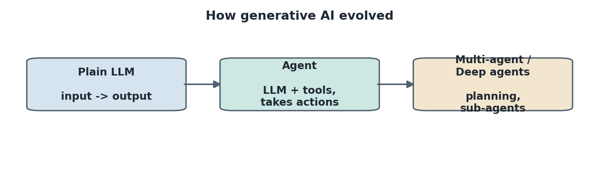


A plain LLM has one important limit: it is trained only up to a cutoff date, so it cannot answer questions about live or private information on its own. Fixing that limit is the thread that runs through tools, RAG, and agents.

---

## Part 1: The LangChain Ecosystem

### What is LangChain

LangChain is the framework that ties models, prompts, tools, and data sources together.

**LangChain is an open-source framework for building applications on top of LLMs by composing reusable building blocks (models, prompts, tools, retrievers, memory) into a single pipeline.** Plainly: instead of calling a provider's raw API and wiring everything yourself, LangChain gives you standard components that snap together, and it works the same across OpenAI, Google Gemini, Groq, and others.

### What is a Chain

The word "chain" in LangChain has a specific meaning.

**A chain is a sequence of steps linked so that the output of one becomes the input of the next, for example prompt, then LLM, then output parser.** Plainly: it is a pipeline. LangChain expresses this with the pipe operator (LangChain Expression Language):

```python
from langchain_core.prompts import ChatPromptTemplate
from langchain_core.output_parsers import StrOutputParser

prompt = ChatPromptTemplate.from_messages([("system", "You are helpful"), ("user", "{question}")])
chain = prompt | llm | StrOutputParser()      # prompt -> llm -> parsed string
chain.invoke({"question": "What is RAG?"})
```

The `|` reads left to right: the prompt is filled, passed to the LLM, and the LLM output is parsed into a clean string.
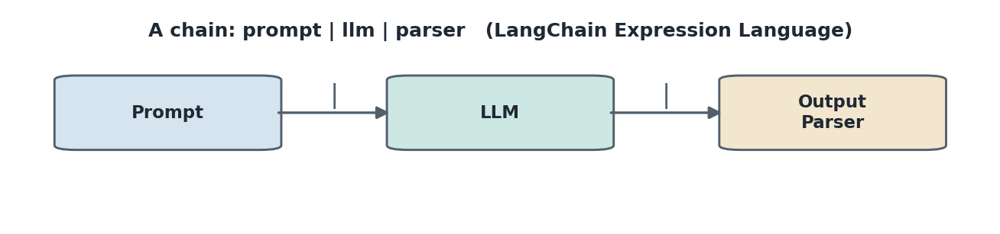


### LangGraph

When a workflow is more than a straight line, LangChain alone is not enough.

**LangGraph is a library for building stateful, multi-step, and multi-agent workflows as a graph of nodes and edges, where agents can loop, branch, and communicate.** Plainly: a chain is a straight pipeline, while a graph can loop back, take conditional paths, and remember state across steps. It is the right tool when one agent must call another, or when a task needs explicit planning and state management. (Full detail in Part 2.)

### LangSmith

Building is half the work; observing and testing is the other half.

**LangSmith is a unified observability and evaluation platform where you can trace, debug, test, and monitor LLM applications, whether or not they were built with LangChain.** Plainly: it logs every call so you can see each prompt, response, token, and dollar, and it hosts datasets and experiments for evaluation. (Used heavily in Part 7.)

### The LangChain ecosystem

These pieces fit together:

- **LangChain**: the building blocks (models, prompts, chains, tools, retrievers, memory).
- **LangGraph**: stateful graphs for agents and complex workflows.
- **LangSmith**: observability, tracing, datasets, and evaluation.
- **Integrations**: provider packages such as `langchain-openai`, `langchain-google-genai`, `langchain-groq`, plus vector stores, loaders, and adapters (for example `langchain-mcp-adapters`).
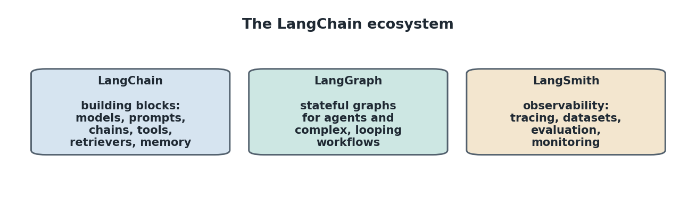


### Project setup with UV

Every project starts in an isolated environment.

**UV is an extremely fast Python package and project manager written in Rust.** It is a single tool that replaces pip, virtualenv, and poetry, and it resolves and installs packages far faster because the work is compiled Rust rather than Python.

```bash
uv init                      # initialize the folder as a project
uv venv                      # create a virtual environment named .venv
.venv\Scripts\activate       # activate it (Windows); source .venv/bin/activate on Mac/Linux
uv add -r requirement.txt    # install everything in requirement.txt
uv add langchain             # install a single library directly
uv add ipykernel             # kernel so the venv works inside Jupyter
```

Keys go in a `.env` file (OpenAI, Google, Groq) and load with `python-dotenv`.

### What is an Agent

An agent is the first step beyond a plain LLM.

**An agent is an LLM that decides, on its own, whether to answer directly or call an external tool to get information it does not have.** Plainly: a plain LLM only knows its training data, so "today's AI news" is unanswerable from the model alone. An agent recognizes that gap, calls a tool that has the live data, takes back the tool output as context, and only then generates the final answer. The decision-making is what makes it autonomous.

```python
from langchain.agents import create_agent

def get_weather(city: str) -> str:
    """Get the weather for a city."""
    return f"The weather in {city} is sunny"

agent = create_agent(model="gpt-5", tools=[get_weather], system_prompt="You are a helpful assistant")
response = agent.invoke({"messages": [{"role": "user", "content": "What is the weather in New York?"}]})
print(response["messages"][-1].content)
```

Two essentials: the input must be a dict keyed on `messages`, and the LLM picks a tool by reading its **docstring**, which is the schema description it matches against the request.
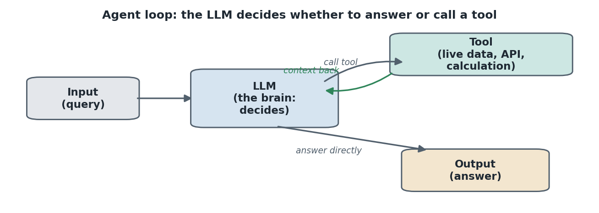


### Model integration

The same code runs on any provider.

**`init_chat_model` is a generic loader: pass `provider:model_name` and it returns the right chat model object**, saving a separate import per provider.

```python
from langchain.chat_models import init_chat_model

model = init_chat_model("gpt-4.1")                          # OpenAI
model = init_chat_model("google_genai:gemini-2.5-flash")    # Google Gemini
model = init_chat_model("groq:qwen-qwq-32b")                # Groq (open-source models, fast inference)
```

Provider classes (`ChatOpenAI`, `ChatGoogleGenerativeAI`, `ChatGroq`) do the same thing.

### Streaming and batch

Two execution patterns matter for real chatbots.

**Streaming yields the output token by token while it is generated, instead of waiting for the whole response**, which makes a chat UI feel responsive on long answers.

```python
for chunk in model.stream("write a 200 word paragraph on AI"):
    print(chunk.text, end="", flush=True)
```

**Batch sends multiple independent requests in parallel, improving throughput and cutting cost.** `max_concurrency` caps how many run together, so 10 prompts with a cap of 5 go out in two waves.

```python
responses = model.batch(["q1", "q2", "q3"], config={"max_concurrency": 5})
```

### Tools

A tool extends the model beyond its own knowledge.

#### Why do we use tools

**Tools let the LLM reach things it cannot do alone: live data, exact calculations, actions on external systems, and private APIs.** Plainly: the model is trained and frozen, so anything current, computational, or proprietary has to come from a tool.

**The `@tool` decorator marks a function as a tool, and its docstring becomes the schema the LLM uses to decide when to call it.**

```python
from langchain.tools import tool

@tool
def get_weather(location: str) -> str:
    """Get weather at a location."""
    return f"It's sunny in {location}"

model_with_tools = model.bind_tools([get_weather])
response = model_with_tools.invoke("What's the weather like in Boston?")
print(response.tool_calls)
```

`bind_tools` only tells the model which tools exist. Running the chosen tool and feeding the result back is the **tool execution loop**: invoke the model, append the AI message, run each tool call with `tool.invoke(call)`, append the tool result, then invoke the model again so it answers with the context.

### Messages

Messages are the fundamental unit of context, and their role matters most.

**A message has a role, content, and optional metadata; the role identifies the type:** system (instruction on how to behave), human (user input), AI (model response, including tool calls), and tool (output from a tool call). A bare string is treated as a human message (a **text prompt**, good for single standalone requests). A list of role-tagged messages is a **message prompt**, used for conversation history and system instructions:

```python
from langchain.messages import SystemMessage, HumanMessage

messages = [
    SystemMessage("You are a senior Python developer. Always provide code examples and explain your reasoning."),
    HumanMessage("How do I create a REST API?"),
]
response = model.invoke(messages)
```

A detailed system message yields a more specific answer than a generic one. Token usage is on `response.usage_metadata`.

### Structured output

Sometimes the answer must be a fixed shape, not free text.

**Structured output forces the model to return a response matching a given schema, so the result can be parsed and reused downstream.** Three schema styles:

- **Pydantic**: richest, with field validation, descriptions, and nested structures.
- **TypedDict**: a plain dict at runtime, no validation (a wrong type slips through).
- **Dataclass**: like TypedDict, a schema with no validation.

```python
from pydantic import BaseModel, Field

class Movie(BaseModel):
    title: str = Field(description="The title of the movie")
    year: int = Field(description="The year the movie was released")
    rating: float = Field(description="The movie's rating out of 10")

model_with_structure = model.with_structured_output(Movie)
model_with_structure.invoke("Provide details about the movie Inception")
# -> title='Inception', year=2010, rating=8.8
```

The key Pydantic property is **field validation**: `title` must be a string, `year` an int, `rating` a float, otherwise it errors. With `create_agent`, the schema is passed via `response_format=` instead of `with_structured_output`.

### Middleware

Middleware controls what happens inside an agent.

**Middleware exposes hooks (trigger points) around an agent: before the agent, before the model, around tool calls, after the model, or after the agent.** A useful analogy is airport security, where a passenger passes a luggage check, then immigration, then a boarding-pass check before the gate, and each checkpoint is a middleware. Uses include logging, summarization, retries, fallbacks, rate limits, and guardrails.

**Summarization middleware** compresses older conversation when it grows too large while keeping recent messages:

```python
from langchain.agents.middleware import SummarizationMiddleware

middleware=[SummarizationMiddleware(model="gpt-4o-mini", trigger={"messages": 10}, keep={"messages": 4})]
```

When the count crosses 10, older messages collapse into a summary. Triggers can also be token-based (`{"tokens": 550}`, keep 200) or a fraction of the context window. A rough estimate of 4 characters per token means about 2200 characters is roughly 550 tokens.

**Human-in-the-loop middleware** pauses execution before a sensitive tool and waits for approval, editing, or rejection (detailed in Part 2 and Part 6).

---

## Part 2: LangGraph

LangGraph handles stateful, multi-step, and multi-agent workflows where agents may communicate.

### The three components: nodes, edges, state

The framework rests on three pieces.

**A node is a unit of work, an edge is the connection that passes information from node to node, and state is the shared data every node can read and write.** A clear example is a YouTube-to-blog workflow: take a URL, pull the transcript (node 1), generate a title from it (node 2), then generate the blog content from title plus transcript (node 3), with start and end nodes bracketing the flow. State holds variables like `transcript`, `title`, and `content` so any node can access them. The whole thing is a **state graph** because it maintains state across nodes.

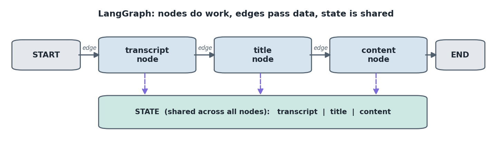


### Reducers and add_messages

A chatbot needs state that accumulates rather than overwrites.

**A reducer defines how a state key is updated, and `add_messages` is the reducer that appends messages to a list instead of replacing them.**

```python
from typing import Annotated
from typing_extensions import TypedDict
from langgraph.graph import StateGraph, START, END
from langgraph.graph.message import add_messages

class State(TypedDict):
    messages: Annotated[list, add_messages]   # list, appended via the reducer
```

`Annotated[list, add_messages]` says "this key is a list, and updates append to it," so every human and AI turn is kept.

### Basic chatbot

The smallest useful graph is start, one chatbot node, end.

```python
def chatbot(state: State):
    return {"messages": llm.invoke(state["messages"])}

graph_builder = StateGraph(State)
graph_builder.add_node("llm_chatbot", chatbot)
graph_builder.add_edge(START, "llm_chatbot")
graph_builder.add_edge("llm_chatbot", END)
graph = graph_builder.compile()        # compilation is required before running
graph.invoke({"messages": "hi"})
```

Visualize with `graph.get_graph().draw_mermaid_png()`.

### Streaming modes: values vs updates

Running with `stream` exposes two modes.

**In `updates` mode the stream emits only the message from the node that just ran; in `values` mode it emits the entire accumulated state each step.** Plainly: `updates` shows just the new AI message, `values` shows the whole growing conversation each turn.

```python
for chunk in graph.stream({"messages": "..."}, config, stream_mode="updates"):  # latest AI message only
    ...
for chunk in graph.stream({"messages": "..."}, config, stream_mode="values"):   # full conversation list
    ...
```

`astream_events` gives detailed per-event debugging output.

### Tools, tool node, and tool condition

Tools are added as a separate node with a conditional route.

```python
from langgraph.prebuilt import ToolNode, tools_condition

llm_with_tools = llm.bind_tools(tools)

def tool_calling_llm(state: State):
    return {"messages": llm_with_tools.invoke(state["messages"])}

builder = StateGraph(State)
builder.add_node("tool_calling_llm", tool_calling_llm)
builder.add_node("tools", ToolNode(tools))
builder.add_edge(START, "tool_calling_llm")
builder.add_conditional_edges("tool_calling_llm", tools_condition)   # routes to tools OR end
builder.add_edge("tools", END)
graph = builder.compile()
```

**`tools_condition` is a built-in router: if the last AI message is a tool call it routes to the tools node, otherwise to end.** The tools node must be named `tools` for it to be found.

### React agent

A graph that ends after one tool call cannot handle a two-part question. The fix is to loop the tool output back to the model.

**A React agent loops tool results back to the LLM so the model can decide whether to call another tool or finish, following the cycle act, observe, reason.** The only structural change is the edge from tools back to the LLM rather than to end:

```python
builder.add_edge("tools", "tool_calling_llm")   # instead of -> END
```

Now "give me the recent AI news and then multiply 5 by 10" works: call web search, get the result, see the second clause, call `multiply`, get 50, and combine both. This loop is why agentic AI became powerful.

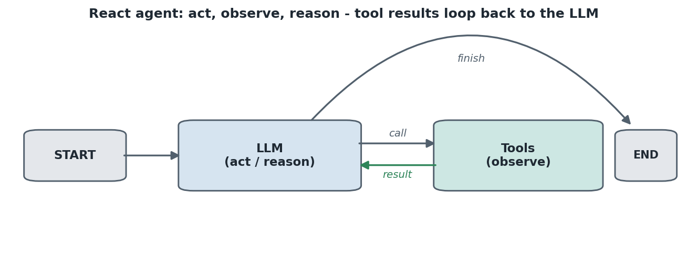


### Memory

By default a graph forgets previous turns.

#### Why and how

**A checkpointer persists the graph state across turns, and a thread id ties a sequence of turns to one user session.** Without it, telling the graph your name and then asking "what is my name" fails.

```python
from langgraph.checkpoint.memory import MemorySaver

memory = MemorySaver()
graph = builder.compile(checkpointer=memory)
config = {"configurable": {"thread_id": "1"}}
graph.invoke({"messages": "hi my name is Alex"}, config)
graph.invoke({"messages": "what is my name?"}, config)   # remembers: Alex
```

`MemorySaver` is an in-memory store backed by a dictionary; the `thread_id` must be unique per user. (Memory types and optimisation are covered in the Memory section under the response pipeline.)

### Human in the loop

LangGraph has its own pause mechanism.

**`interrupt` forcefully pauses a workflow inside a tool so a human can supply a response, and `Command(resume=...)` continues the flow with that response.**

```python
from langgraph.types import Command, interrupt

@tool
def human_assistance(query: str) -> str:
    """Request assistance from a human."""
    human_response = interrupt({"query": query})
    return human_response["data"]

# after the graph interrupts:
graph.stream(Command(resume={"data": "expert recommendation..."}), config, stream_mode="values")
```

### MCP servers

The Model Context Protocol standardizes tool access.

**MCP has three pieces: an MCP server that exposes tools, an MCP client that connects to servers, and the app that uses the client.** Plainly: tools are exposed behind a standard protocol so the app talks to them through a client rather than hardcoding each integration.

Servers are built with FastMCP, and **the transport is how client and server communicate**:

- **stdio**: the server uses standard input and output; the client launches the script and reads results from the command line. Good for local testing.
- **streamable HTTP**: the server runs as an API at a URL (default `http://localhost:8000/mcp`). Good when it runs as a service.

```python
from langchain_mcp_adapters.client import MultiServerMCPClient
from langgraph.prebuilt import create_react_agent

client = MultiServerMCPClient({
    "math":    {"command": "python", "args": ["math_server.py"], "transport": "stdio"},
    "weather": {"url": "http://localhost:8000/mcp", "transport": "streamable_http"},
})
tools = await client.get_tools()
agent = create_react_agent(model, tools)
```

A math server answering `3 + 5 * 12` returns `8 * 12 = 96`. Because the client is async, the whole thing runs under `asyncio.run(main())`.

---

## Part 3: Retrieval Augmented Generation (RAG)

About 90 percent of company use cases today are RAG, so it is treated in depth here, from basics to modular code.

### What is RAG and why

A plain LLM has two problems RAG fixes.

**RAG optimizes an LLM's output by referencing an authoritative knowledge base outside its training data, without retraining the model.** The two problems it solves:

- **Hallucination**: an LLM has a training cutoff, so for events after that date it invents plausible-sounding answers rather than admitting it does not know.
- **Private or changing data**: a company's HR, finance, and policy documents are not in the model, and fine-tuning on them is expensive, slow (billions of parameters), and must be redone every time the data changes.

RAG sidesteps both: store the documents in a vector database and retrieve relevant context per query.

### Types of RAG

RAG comes in several flavors, increasing in capability.

**The main types are naive (traditional vector) RAG, modular RAG, agentic RAG, vectorless RAG, graph RAG, and hybrid RAG.** Plainly:

- **Naive / traditional RAG**: chunk, embed, store in a vector DB, retrieve by similarity, generate. The baseline.
- **Modular RAG**: the same pipeline split into reusable, swappable components (loader, chunker, embedder, store, retriever).
- **Agentic RAG**: an agent decides when and what to retrieve, can use multiple retrievers and tools, and can re-query.
- **Vectorless RAG**: no vector DB at all; an LLM navigates a document tree by reasoning (Part 4).
- **Graph RAG**: knowledge stored as a graph of entities and relationships, retrieved by traversing connections.
- **Hybrid RAG**: combines approaches, for example vector similarity plus keyword search, or traditional plus vectorless.

### Components of RAG

Every RAG system is built from the same stages.

**The components are: ingestion (loaders), parsing, chunking, embedding, vector store, retriever, augmentation (prompt plus context), and generation (LLM).** The two pipelines that group them:

- **Data ingestion pipeline**: ingest, parse, chunk, embed, store.
- **Retrieval pipeline**: embed the query, similarity-search the store for context, combine context with a prompt (**augmentation**), then generate (**generation**).

A good real example is Perplexity, which is built on RAG: it connects to retrievers, tools, and web search, then summarizes with an LLM.
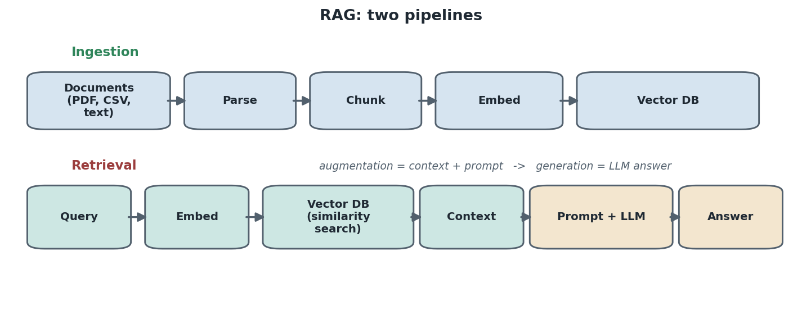


### Document structure

Everything in ingestion ends up as a document object.

**A LangChain Document has two core parts: `page_content` (the actual text) and `metadata` (extra information about that text such as source filename, page count, author, and date).** Metadata matters because at retrieval time you can apply **filters** (for example, search only documents by a given author).

```python
from langchain_core.documents import Document
doc = Document(page_content="...main text...", metadata={"source": "example.txt", "author": "Jane Doe"})
```

**Loaders** read a file type and return content already wrapped as Documents: `TextLoader`, `PyPDFLoader`, `PyMuPDFLoader` (richer metadata), `CSVLoader`, plus directory and web-based loaders. Everything comes back as a list of Document objects regardless of loader.

### Chunking

Documents are split before embedding.

**Chunking divides documents into smaller pieces so they fit inside the fixed context window of the embedding and LLM models.** A 100-page PDF cannot be embedded in one shot, so it is cut into overlapping chunks.

```python
from langchain.text_splitter import RecursiveCharacterTextSplitter
splitter = RecursiveCharacterTextSplitter(chunk_size=1000, chunk_overlap=200)
chunks = splitter.split_documents(all_documents)
```

**`chunk_overlap` is the number of characters shared between adjacent chunks**, which preserves context across the boundary. As a reference figure, 64 page-level documents split into 359 chunks at size 1000, overlap 200.
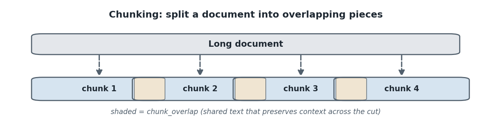


### Types of chunking

How you split changes retrieval quality.

**The main strategies are fixed-size, recursive character, document or structure aware, semantic, and sentence or token based chunking.** Plainly:

- **Fixed-size (character)**: cut every N characters. Simplest, but can split mid-sentence.
- **Recursive character**: split on a priority list of separators (paragraph, then line, then space) so cuts fall on natural boundaries where possible. The common default.
- **Document / structure aware**: split on the document's own structure (headings, sections, markdown, code blocks) so each chunk is a logical unit.
- **Semantic chunking**: use embeddings to detect topic shifts and cut where meaning changes, keeping related sentences together.
- **Sentence / token based**: split on sentence boundaries or a fixed token count, often with a sliding window of overlap.

The trade-off is that smaller chunks give precise retrieval but lose context, while larger chunks keep context but dilute relevance.

### Vector embedding

Chunks become vectors.

**Embedding converts text into a numerical vector so similarity algorithms (cosine similarity, similarity search) can run on it.** A vector is just a list of numbers representing meaning, so similar text produces nearby vectors.

```python
from sentence_transformers import SentenceTransformer
model = SentenceTransformer("all-MiniLM-L6-v2")     # 384-dimensional vectors
embeddings = model.encode(texts, show_progress_bar=True)
```

`all-MiniLM-L6-v2` produces 384 dimensions, so every chunk becomes a vector of length 384.

### Types of vector embedding to do RAG

Different embedding models suit different needs.

**Common embedding choices are OpenAI embeddings, Google Gemini embeddings, HuggingFace sentence-transformers (open source), and Cohere embeddings.** Plainly:

- **OpenAI** (for example `text-embedding-3-small` / `-large`): strong quality, paid per token.
- **Google Gemini embeddings**: strong quality, paid, good for Google-stack apps.
- **HuggingFace sentence-transformers** (for example `all-MiniLM-L6-v2`, BGE, instructor): open source and free to run locally, dimensions vary by model.
- **Cohere embeddings**: paid, strong multilingual support.

The broader distinction is **dense embeddings** (a single rich vector capturing meaning, used for semantic search) versus **sparse embeddings** (high-dimensional keyword-style vectors, used for exact-term matching). Hybrid search combines both.

### Vector database

Vectors are stored where they can be searched.

**A vector store (vector DB) holds the embeddings and lets you run similarity search over them.** A persistent directory means the store survives on disk and can be reloaded without rebuilding.

```python
import chromadb
client = chromadb.PersistentClient(path="data/vector_store")
collection = client.get_or_create_collection("pdf_documents")
collection.add(ids=ids, embeddings=embedding_list, metadatas=metadatas, documents=document_texts)
```

Each record carries a UUID, the embedding, the metadata, and the page content.

### Types of vector database

There are many vector stores, open source and managed.

**Common options are Chroma, FAISS, Pinecone, Weaviate, Qdrant, and Milvus**, ranging from lightweight local stores to managed cloud services.

#### Chroma DB, FAISS, Pinecone

The three used most often in these notes:

- **Chroma DB**: an open-source, developer-friendly vector store that runs locally with a persistent client. Easy to start with, good for prototypes and small to medium apps.
- **FAISS** (Facebook AI Similarity Search): an open-source library for very fast similarity search and indexing, runs locally, scales well, and is saved as an index file plus a metadata pickle. Great when you want speed without a server.
- **Pinecone**: a managed, cloud-hosted vector database that handles scale, availability, and indexing for you. Good for large production systems where you do not want to run the store yourself.

### Retriever

The query side mirrors ingestion.

**A retriever embeds the query, searches the vector store, and returns the closest chunks as context, optionally filtered by a similarity threshold.** The similarity score is computed from the Chroma distance as `score = 1 - distance`, so a distance of 0.25 is a similarity of 0.75.

```python
def retrieve(self, query, top_k=3, score_threshold=0.0):
    q_emb = self.embedding_manager.generate_embeddings([query])
    results = self.vector_store.collection.query(query_embeddings=q_emb.tolist(), n_results=top_k)
    # keep results whose (1 - distance) is above the threshold
    return retrieved_docs
```

### LLM integration (augmentation and generation)

Retrieved context is combined with a prompt and sent to the LLM.

```python
def rag_simple(query, retriever, llm, top_k=3):
    results = retriever.retrieve(query, top_k=top_k)
    context = "\n\n".join(doc["content"] for doc in results) if results else ""
    if not context:
        return "No relevant context found to answer the question."
    prompt = f"Use the following context to answer the question concisely.\n\nContext:\n{context}\n\nQuestion: {query}"
    return llm.invoke(prompt).content
```

An enhanced version also returns sources, a confidence score (the similarity), and the full context; a further version adds streaming, citations, history, and summarization.

### Modular coding

The notebook code is finally reorganized into a reusable pipeline.

**Modular RAG splits the pipeline into linked components, each its own file: a data loader, an embedding pipeline, a vector store, and a search module.** A typical `src/` layout is `data_loader.py` (load PDFs, text, CSV into Documents), `embedding.py` (chunk and embed), `vector_store.py` (FAISS build, save, load, search), and `search.py` (retrieve plus LLM answer), wired by an `app.py`. The store saves to `index.faiss` plus `metadata.pkl` and only needs rebuilding when new documents arrive (`store.load()` reads the persisted directory directly).

---

## Part 4: The Response Pipeline

The response (retrieval) pipeline is the path a query takes from the user to the final answer. Breaking it into named stages makes each optimisation point clear.
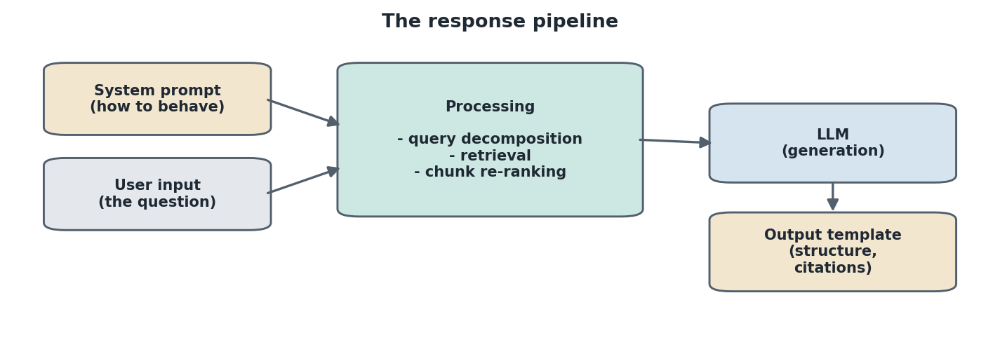


### System prompt

The first ingredient in the pipeline is the instruction layer.

**A system prompt is a fixed instruction that tells the LLM how to behave: its role, tone, rules, and how to use the retrieved context.** Plainly: it frames every answer, for example "You are a helpful assistant. Use only the provided context. If the answer is not in the context, say you do not know." A detailed system prompt produces more accurate, on-policy answers than a generic one.

### User input

The pipeline is triggered by the user's query.

**User input is the raw question the user sends, which becomes the starting point of retrieval and generation.** Plainly: whatever the user types. It is treated as a human message and, in RAG, is first embedded so it can be matched against the vector store.

### Processing

Between the raw input and the LLM, the query is shaped.

**Processing is the set of steps applied to the user input before generation: cleaning, embedding, retrieval, and any query transformation.** Plainly: the raw question is normalized, turned into a vector, used to fetch context, and optionally rewritten or split for better retrieval. The next two stages, query decomposition and chunk re-ranking, are the most important processing steps.

### Query decomposition

Complex questions retrieve poorly as a single query.

**Query decomposition breaks a complex, multi-part question into smaller sub-queries that are retrieved and answered separately, then combined.** Plainly: "What are the disadvantages of pattern recognition and how do they relate to economics?" is split into "disadvantages of pattern recognition" and "relation to economics," each retrieving its own context.

#### Why we use it

A single embedding of a multi-part question is a blurry average of several topics, so it matches no chunk well. Splitting it means each sub-query is focused, retrieves the most relevant chunks for its part, and the final answer is assembled from precise pieces. This is what lets a system handle complex queries that a one-shot retrieval would fail.

### Chunk re-ranking

Initial retrieval is fast but imprecise, so a second pass sharpens it.

**Chunk re-ranking takes the top candidates from the first retrieval and re-scores them with a more precise model, pushing the most relevant chunks to the top before they reach the LLM.** Plainly: the vector search returns, say, the top 20 chunks by rough similarity; a reranker then carefully reads each against the query and reorders them so the best few go into the prompt.

#### Technique

The first retrieval uses a **bi-encoder** (the embedding model), which encodes the query and chunks separately and compares vectors. This is fast but approximate. Re-ranking uses a **cross-encoder** (a reranker such as Cohere Rerank or a BGE reranker) that reads the query and a candidate chunk together and outputs a precise relevance score. You retrieve a wide top-k cheaply, then re-rank to a small, accurate top-n.

#### How it optimises a chatbot

Better-ordered context means the LLM sees the most relevant chunks first and fewer irrelevant ones. The effects: less hallucination (answers are grounded in genuinely relevant text), higher accuracy, and lower cost and latency (fewer wasted tokens on irrelevant chunks in the prompt).
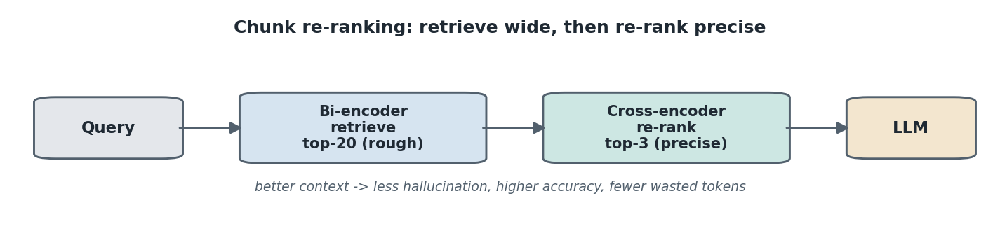


### Output template

The final stage shapes how the answer is returned.

**An output template is a fixed format the final answer must follow: structure, fields, citations, and tone.** Plainly: rather than free text, the response is forced into a consistent shape, for example a short concise answer plus cited sources and page numbers, or a structured object. This makes responses predictable, parseable, and easy to display, and pairs naturally with structured output (Part 1).

---

## Part 5: Memory

Memory is what lets a conversation feel continuous instead of starting fresh each turn.

### What is memory

**Memory is the mechanism that stores and recalls prior turns of a conversation so the model can use earlier context in later responses.** Without it, each turn is independent, so telling the assistant your name and then asking "what is my name" fails.

### Types of memory

Different memory types trade completeness against cost.

**The main types are short-term (buffer) memory, long-term (persistent) memory, summary memory, entity memory, and vector-store-backed memory.** Plainly:

- **Short-term / buffer memory**: keeps the recent conversation in full within a session. Simple and exact, but grows without bound.
- **Long-term / persistent memory**: stored across sessions (in a database or checkpointer) so the assistant remembers a user over time.
- **Summary memory**: compresses older turns into a running summary to control size while keeping the gist.
- **Entity memory**: tracks specific facts about entities (people, projects) mentioned in the conversation.
- **Vector-store-backed memory**: embeds past turns and retrieves only the relevant ones when needed, like RAG over the conversation history.

### How do we use it, and how do we optimise it

In LangGraph, memory is wired with a **checkpointer plus a thread id**: the checkpointer saves state and the thread id is the per-user session key.

```python
graph = builder.compile(checkpointer=MemorySaver())
config = {"configurable": {"thread_id": "user-123"}}
graph.invoke({"messages": "hi my name is Alex"}, config)
graph.invoke({"messages": "what is my name?"}, config)   # remembers
```

To **optimise** memory and stop the context from blowing up: apply summarization middleware to compress older turns, use a windowed buffer that keeps only the most recent N messages, switch to vector-store-backed memory so only relevant history is retrieved, and trigger summarization on a token or message threshold (for example summarize once the conversation passes 10 messages or 550 tokens, keeping the most recent few). The goal is to retain enough context for good answers without paying to resend the entire history every turn.

---

## Part 6: Agents and Deep Agents

Agents were introduced in Part 1. This part contrasts the agent types and goes deeper.

### Recap: what is an agent

**An agent is an LLM that decides whether to answer directly or call a tool, then uses the tool output as context to produce the final answer.** The decision-making is what makes it autonomous.

### Shallow agent

The simplest agent is the contrast point.

**A shallow agent is a simple loop: input goes to the LLM, the LLM either answers or calls a tool, and the result is returned, with no planning, no deep reasoning, and limited context retention.** It cannot handle a complex query that needs to be decomposed.

### React agent

A React agent is an improvement but still shallow.

**A React agent loops the LLM and tools any number of times based on the observed tool output, but it still only does LLM plus tool, with no structured plan, no state management, and no persistent memory.**

### Deep agent

Deep agents power deep-research tools and have a different architecture.

**A deep agent has four core components: a planning tool, sub-agents, a system prompt, and a file system.** Plainly:

- **Planning tool**: on a query, the agent first makes a to-do list (a plan) rather than answering directly.
- **Sub-agents**: each to-do item is executed by a dedicated sub-agent, giving context isolation.
- **System prompt**: defines how each agent behaves.
- **File system**: a persistent, shared memory accessible to all sub-agents, so they can save work and communicate.

A blog example: the to-do list is research, more research, write, copyright check; one sub-agent has internet access, another has arxiv access, another writes, another checks copyright, and the tasks run in parallel.
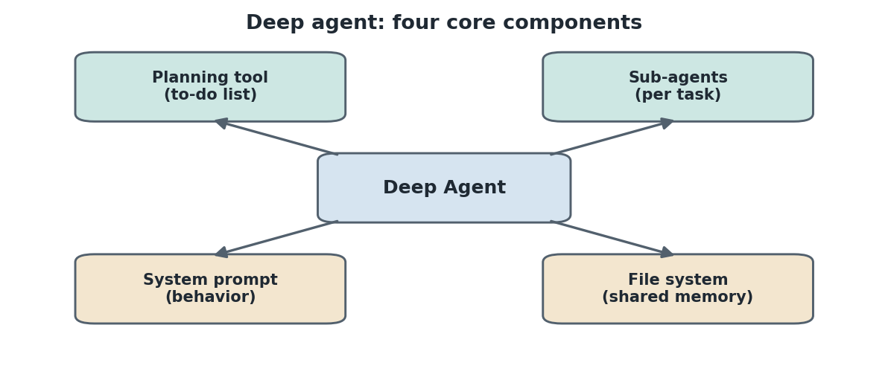


```python
from deepagents import create_deep_agent

agent = create_deep_agent(tools=[web_search], system_prompt="Act as a researcher", model=model)
result = agent.invoke({"messages": [{"role": "user", "content": "what is a deep agent"}]})
print(result["messages"][-1].content)
print(result["files"])   # files the agent created to preserve context
```

The difference from a plain agent shows in the compiled graph: a deep agent comes with extra middleware hooks (a path-to-tool-calls hook, a summarization hook, and an automatic to-do list after the model) that a plain agent lacks.

---

## Part 7: Hallucinations

Hallucination is the central failure mode the whole stack works to prevent.

### What is hallucination

**A hallucination is when an LLM produces confident, fluent output that is factually wrong or unsupported by any source.** Plainly: the model would rather generate a plausible answer than admit it does not know, so it fills the gap with invented content that reads as true.

The main causes: the answer is outside the model's training data, it falls after the training cutoff, the prompt is ambiguous, or the retrieved context was irrelevant or missing.

### Coming up with a solution

The remedy is to ground the model and check its work.

**The core solution is grounding the model with retrieval (RAG) so answers are based on real source documents, plus instructions that allow the model to say it does not know.** Concretely:

- **Ground with RAG**: retrieve relevant context and instruct the model to answer only from it.
- **Cite sources**: return citations (section, page) so claims are traceable.
- **Lower the temperature**: less randomness means fewer invented details for factual tasks.
- **Allow "I do not know"**: explicitly permit the model to refuse when context is missing, instead of guessing.
- **Guardrails**: filter unsafe or out-of-scope requests before and after generation (Part 8).
- **Groundedness evaluation**: measure whether each answer is actually supported by the retrieved documents (Part 9).

### What is the better thing to do

Beyond grounding, retrieval quality itself is the bigger lever.

**The strongest improvement is making retrieval better, so the model is handed genuinely relevant context: use query decomposition, chunk re-ranking, better chunking, and a high-quality embedding model.** Plainly: a model that hallucinates is often a model given the wrong context, so fixing retrieval (decompose complex queries, re-rank candidates, chunk on logical boundaries, choose a strong embedding model) removes the root cause. For long structured documents, vectorless RAG (next part) preserves whole sections and avoids the context loss that chunking can cause.

The rest of these notes (vectorless RAG, guardrails, evaluation, gateways) are the detailed tools for doing exactly this.

---

## Part 8: Vectorless RAG

A newer approach removes the vector database entirely and navigates a document the way a human reads a book.

### LLM tree builder and JSON tree index

**Vectorless RAG builds a hierarchical tree of the document's sections with an LLM, where each leaf node holds an LLM-written summary of that section's pages, and stores it as a JSON tree index instead of vectors.** Plainly: it turns the table of contents into a tree (introduction, then AI with subsections ML and DL, and so on), and at each node it keeps a summary of that section's page content.

There is no vector database. The JSON tree index can be stored anywhere that holds key-value data: the file system, an S3 bucket, or MongoDB.
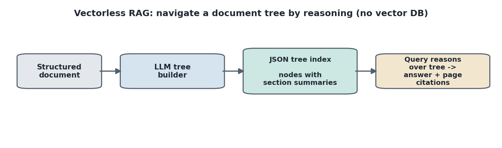


### Retrieval by reasoning

**On a query, the LLM is given the whole JSON tree as context, reasons about which nodes likely hold the answer, traverses to them, pulls their summarized content, and generates the answer with section and page citations.** Like checking a book's table of contents, finding the page, and reading the section, except the node summaries are already written.

```python
from pageindex import PageIndexClient
pi = PageIndexClient(api_key=PAGEINDEX_API_KEY)
doc = pi.submit_document(pdf_path)                 # uploads and builds the tree (50 pages ~ 30 to 90s)
tree = pi.get_tree(doc_id, node_summary=True)      # JSON tree with node summaries
```

### When there is no table of contents

**Without a table of contents, the LLM reads the pages, infers the headings and structure, and does section-aware splitting that respects logical boundaries rather than token counts.** This is the core difference from traditional chunking: traditional splitting can cut a section three ways on token count, whereas section-aware splitting keeps each section whole, then summarizes it into a node.

### Traditional vs vectorless

Side by side:

- **Scale**: traditional handles millions of documents; vectorless suits tens to thousands.
- **Latency per query**: traditional is one embedding plus one search; vectorless makes multiple LLM calls to traverse the tree, so it is slower.
- **Cost per query**: traditional is cheap; vectorless is higher.
- **Cross-section reasoning**: traditional is weak (chunking can lose cross-section context); vectorless is strong (whole sections summarized).
- **Explainability**: traditional returns a cosine score; vectorless returns a navigation path showing why nodes were chosen.
- **Best for**: traditional for fact lookups and mixed corpora; vectorless for long structured documents (annual reports, 10-Ks, legal contracts, textbooks).
- **Embedding pipeline**: traditional needs one and must re-embed if the model changes; vectorless needs none.

They are complementary, not competitors, and production systems are moving to **hybrid RAG**: scale from traditional plus reasoning and structure from vectorless. The right pick depends on the document.

---

## Part 9: Guardrails

Guardrails are safety mechanisms that control what goes into and comes out of an AI agent.

### Two approaches

**A deterministic guardrail uses rule-based logic (regex, keyword matching) with zero LLM cost but no understanding of meaning; a model-based guardrail uses an LLM to judge safety, which understands semantics but costs an LLM call per check.**

```python
def deterministic_guardrail(text):                 # zero LLM cost
    banned = ["hack", "exploit", "malware", "bomb"]
    return any(b in text.lower() for b in banned)  # True means blocked
```

The example "explain how malware spreads" is blocked by the deterministic keyword match but judged safe by an LLM, which reads it as a generic educational question.

### PII middleware

**PII middleware detects personally identifiable information (email, credit card, IP, MAC address, URL) and applies a strategy: redact, mask, hash, or block.** It applies to input, output, and tool calls.

```python
from langchain.agents.middleware import PIIMiddleware

middleware=[
    PIIMiddleware("email", strategy="redact", apply_to_input=True),
    PIIMiddleware("credit_card", strategy="mask", apply_to_input=True),
    PIIMiddleware("api_key", detector=r"sk-[a-zA-Z0-9]{32}", strategy="block", apply_to_input=True),
]
```

`block` raises an exception, so calls using it are wrapped in try/except.

### Human in the loop

The human-approval pattern as a guardrail for high-impact tools:

```python
from langchain.agents.middleware import HumanInLoopMiddleware
middleware=[HumanInLoopMiddleware(interrupt_on={"send_email": True, "delete_records": True, "search_web": False})]
```

Reading the web is auto-approved; sending email and deleting records require approval.

### Before-agent and after-agent hooks

**A before-agent hook is an input filter that runs before any LLM call (zero cost on blocked requests, which jump straight to end); an after-agent hook validates or rewrites the final response before the user sees it.** A custom middleware subclasses `AgentMiddleware` and implements `before_agent` or `after_agent`. "What is machine learning" passes; "how do I hack into a server" is blocked.
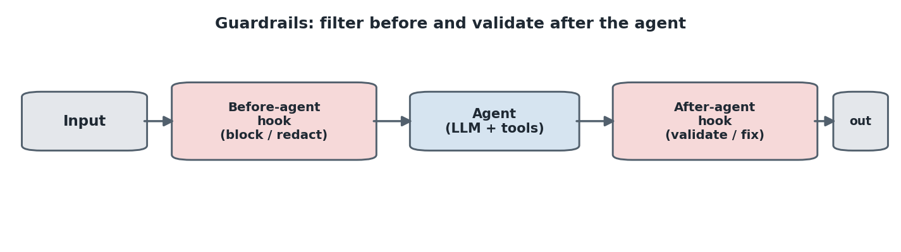


### Layered guardrails

**Layered guardrails combine multiple middlewares in sequence (content filter, then PII, then human-in-the-loop, then model-based output safety) so each request passes every check.** A healthcare chatbot is the canonical example that combines them all.

---

## Part 10: LLM and RAG Evaluation

Evaluation answers which model and pipeline actually perform best, using LangChain and LangSmith.

### LLM as a judge

**LLM as a judge uses an LLM with a grading prompt to compare a model's output against a ground-truth answer and decide whether it is correct.** Instead of a human grading every answer, a second LLM grades them. The steps: gather data points (input plus expected output), use an LLM judge, define metrics, then compare models.

### Datasets in LangSmith

**A LangSmith dataset is a set of examples, each with an input and an expected (reference) output that serves as the ground truth.** Created and populated from code:

```python
from langsmith import Client
client = Client()
dataset = client.create_dataset(dataset_name="chatbot_evaluation")
client.create_examples(dataset_id=dataset.id, examples=[
    {"inputs": {"question": "What is LangChain?"},
     "outputs": {"answer": "A framework for building LLM applications"}},
])
```

Environment needs `LANGSMITH_API_KEY` and `LANGSMITH_TRACING=true`.

### Chatbot metrics

**Correctness uses the LLM judge to grade the model answer against the reference; concision is a deterministic check that the answer is not more than twice the length of the reference.** Each evaluator is a function taking inputs, outputs, and reference outputs and returning a boolean. The evaluation runs via `client.evaluate(target, data="chatbot_evaluation", evaluators=[correctness, concision])`, and the dashboard shows metrics side by side so you can pick the better model (for example gpt-4o-mini vs gpt-4-turbo).

### RAG metrics

**The four RAG metrics are correctness (answer vs reference), answer relevance (answer vs question), groundedness (answer vs retrieved documents), and retrieval relevance (retrieved documents vs question).** Plainly:

- **Correctness**: does the answer match the ground truth.
- **Answer relevance**: does the answer actually address the question.
- **Groundedness**: is the answer supported by the retrieved documents (not hallucinated).
- **Retrieval relevance**: are the retrieved documents actually relevant to the question.

Each is an LLM-as-judge evaluator with its own output schema (an explanation field plus a boolean) and grading prompt, run together with `client.evaluate(...)`. LangSmith reports each metric per example along with latency, token cost, and accuracy.

---

## Part 11: LLM Gateways

The final topic is the production layer that sits in front of model providers.

### The problem

Calling providers directly is fragile: a different SDK per provider, no fallback if one goes down, no central cost tracking, hard to switch models without rewriting code, and paying twice for the same query. A real outage of a major provider once took down apps that hardcoded a single model for about four hours.

### What is an LLM gateway

**An LLM gateway is a smart middleware that sits between your app and multiple LLM providers, so the app never talks to a provider directly and models can be swapped with config changes alone.** The app does not need to know which LLM is used, you can switch models without touching app code, and the gateway adds smart features.
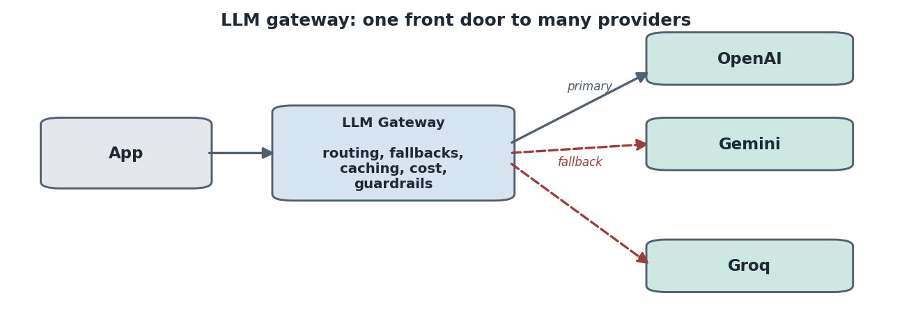


### Core capabilities

- **Unified API**: one function call across hundreds of providers.
- **Automatic fallbacks**: switch to a backup model if the primary fails.
- **Smart routing**: send different request types to different providers.
- **Load balancing**: spread requests across keys or providers to respect rate limits.
- **Caching**: reuse answers for repeated queries, cutting cost 40 to 60 percent on repeats.
- **Observability**: log every call, prompt, response, token, and dollar.
- **Guardrails**: block sensitive inputs before they reach the provider.
- **Evals**: integrate evaluation frameworks.

### LiteLLM completion and fallbacks

**`completion` is LiteLLM's one function that works across all providers; you change only the model string. `fallbacks` lists backup models tried automatically if the primary fails.**

```python
from litellm import completion

completion(
    model="gemini/gemini-1.5-flash",     # primary
    fallbacks=["gpt-4o-mini", "groq/llama-3.3-70b-versatile"],
    messages=[{"role": "user", "content": "..."}],
)   # answer comes back from the first working fallback
```

### Cost tracking and caching

`completion_cost(completion_response=response)` returns the dollar cost of any call from LiteLLM's pricing database. **Caching stores answers so an identical prompt is returned instantly without a new LLM call.** As a reference, a first call of 1.45 seconds and a cached call of 0.0021 seconds is a speedup of about 690x, at zero cost on the second call.

```python
import litellm
from litellm.caching import Cache
litellm.cache = Cache(type="local")
completion(model="gpt-4o-mini", messages=[{"role": "user", "content": "What does LLM stand for?"}], caching=True)
```

### Smart routing and load balancing

**A router maps abstract model names to providers and picks the provider per call, so coding goes to one model and cheap summaries go to another.** A task-aware chatbot first classifies the query (code, summary, general) with a small model, then routes accordingly with fallbacks.

**Load balancing distributes requests across multiple deployments of the same model using a routing strategy, so no single key hits its rate limit.** Strategies: `simple-shuffle`, `least-busy`, and `latency-based-routing` (sends to whichever has been fastest recently).

### LangChain integration

**`ChatLiteLLM` is LangChain's wrapper over LiteLLM, and `.with_fallbacks(...)` adds the fallback chain inside a LangChain chain.**

```python
from langchain_community.chat_models import ChatLiteLLM
robust_llm = ChatLiteLLM(model="gpt-x").with_fallbacks([
    ChatLiteLLM(model="gpt-4o-mini"),
    ChatLiteLLM(model="groq/llama-3.3-70b-versatile"),
])
```

### Guardrails in the gateway

**Input callbacks run before the LLM call, so a guardrail can redact PII (email, phone, SSN, Aadhaar, PAN, credit card, IP) before the model ever sees it**, and a second guardrail blocks prompt injection by matching patterns like "ignore all previous instructions" or "you are now DAN."

```python
import litellm
litellm.input_callback = [pii_input_guardrail]   # redacts then passes the cleaned prompt onward
```

---

## Quick reference: when to use what

- **LangChain**: single agents, model integration, chains, structured output, middleware.
- **LangGraph**: stateful multi-step or multi-agent workflows with explicit nodes, edges, and state.
- **LangSmith**: tracing, datasets, and evaluation.
- **Traditional RAG**: millions of mixed documents, fact lookups, cheap fast retrieval.
- **Vectorless RAG**: long structured documents, reasoning over similarity, explainable retrieval, no vector DB.
- **Query decomposition and re-ranking**: any RAG where retrieval quality or hallucination is the problem.
- **Deep agents**: complex multi-step tasks needing planning, sub-agents, and persistent file memory.
- **Guardrails**: any production agent (PII redaction, human approval on high-impact tools, input and output filters).
- **Evaluation**: LLM-as-judge metrics in LangSmith to compare models and RAG pipelines before shipping.
- **LLM gateways**: production front door for resilience (fallbacks), cost control (tracking, caching), and routing across providers.
